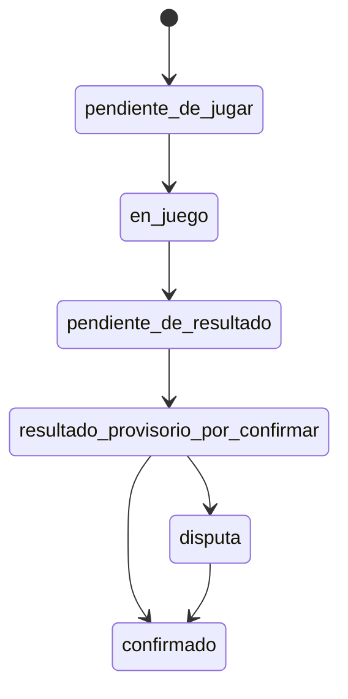

## Soluciones (diseño UX/flujo) — Torneo 2026-01-28

### Contexto y objetivo
Este documento propone **alternativas de solución** (sin implementación todavía) para los problemas priorizados:

- **P2 (Sí o Sí)**: tabla/posiciones confiables en momento crítico.
- **P5 (Sí o Sí)**: arranque fluido (qué partidos empezar) con ausentes + canchas limitadas.
- **P8 (Sí o Sí)**: evitar el costo cognitivo de “más de una página”.

Decisiones ya tomadas:
- **Jugadores como agentes principales** (métrica de éxito).
- **Una sola entrada post-login** (idealmente no cambiar de página).
- **Doble confirmación**: una pareja carga resultado, la otra confirma/corrige; hasta entonces es provisorio.

---

### Principios de diseño (para guiar decisiones)
- **Acción primero**: la pantalla inicial debe guiar a “qué tengo que hacer ahora” antes de “qué puedo mirar”.
- **Una verdad operativa**: estados de partido y estado de tabla deben ser inequívocos (evitar “números raros” sin contexto).
- **Cero ambigüedad en momentos críticos**: al fin de grupos, el sistema debe contestar rápido: “¿falta jugar, falta cargar, o falta confirmar?”.
- **Menos navegación, más progresión**: minimizar cambios de página; usar paneles internos/modales si hace falta.
- **El sistema no asume buena voluntad**: si hay pereza/tiempo/entorno, el diseño debe “empujar” a la acción con fricción mínima.

---

### Alternativas de solución (A/B/C)

#### Alternativa A — **DashboardUnicoJugador** (home orientada a tareas)
**Idea**: un “home” único post-login que ordena lo que importa en vivo.

**Estructura de pantalla (de arriba hacia abajo)**:
1) **CTA primaria contextual** (una sola):
   - “Cargar resultado” (si jugaste y falta cargar)
   - o “Resolver disputa” (si existe y el usuario es parte)
   - o “Confirmar resultado” (si el rival cargó)
   
2) **Bloque Pendientes** (lo que puede trabar la tabla):
   - “Partidos sin resultado / sin confirmar” (solo los tuyos)
3) **Próximo partido recomendado**:
   - quién vs quién, y “por qué” (ej. pendiente, cancha libre, etc.)
4) **Tabla del grupo** con sello de **Confiabilidad**:
   - **confiable** / **parcial** / **incompleta** + “X/Y confirmados”
5) **Explorar** (colapsado): “Fixture del grupo”, “Resultados generales”, “Ayuda”.

**Pros**:
- Muy fuerte para **P8** (una sola entrada) y mejora adopción por “acción guiada”.
- Reduce el problema “primero veo cosas que no necesito” (fixture/resumen).
- Fácil de instrumentar métricas (p.ej. % confirmados).

**Contras/Riesgos**:
- Puede quedarse corto para **P5** si “recomendación de próximo partido” no alcanza sin señalización extra de canchas/ausentes.
- Si el home muestra demasiadas cosas, vuelve a ser “dashboard confuso”.

**Para P2 (confiabilidad)**:
- La tabla se muestra siempre con sello; si no es confiable, el copy lo hace explícito (sin cambiar lógica aún).

---

#### Alternativa B — **MatchCentric** (todo gira alrededor del partido)
**Idea**: la home lista solo “tarjetas” de partidos relevantes y cada tarjeta guía la acción.

**Home**:
- “Mis pendientes de acción” (confirmar / cargar / disputar)
- “Mis próximos partidos”
- (Opcional) “Tabla del grupo” al final, siempre con sello.

**Interacción**:
- Tap en tarjeta => abre un panel (modal/bottom-sheet) con:
  - estado de partido (muy explícito)
  - carga de resultado (simple)
  - confirmación/corrección
  - “impacto” (lectura): cómo afecta el grupo/copa (sin cálculos complejos visibles)

**Pros**:
- Excelente para usuarios no técnicos: reduce a objetos concretos (“mi partido X”).
- Disminuye los errores por “buscar el partido” (P8/P3 indirectamente).

**Contras/Riesgos**:
- Si el jugador necesita coordinar (P5) puede quedar “ciego” sin vista global.
- Requiere una buena definición de “qué partidos mostrar” para no perder contexto.

---

#### Alternativa C — **ModoTorneoAsistido** (jugadores operan; organizador supervisa recomendaciones)
**Idea**: mantener A como base, pero agregar una capa mínima de “operación del torneo” para resolver P5.

**Home del jugador**: como Alternativa A, más un bloque visible:
- **“Ahora se recomienda jugar”** (lista corta de 1–3 partidos) publicada por el organizador.
- **“Canchas disponibles”** (si existe esa señal).

**Rol del organizador**:
- No carga resultados por otros salvo excepción.
- Publica “recomendaciones” para destrabar el arranque y evitar el cálculo mental con ausentes/grupos.

**Pros**:
- Ataca **P5** de forma directa sin obligar al jugador a entender grupos/canchas.
- Mantiene el foco en que el jugador sea el agente (solo sigue recomendaciones).

**Contras/Riesgos**:
- Introduce un “control plane” del organizador (si no se usa, no aporta).
- Riesgo de “doble verdad” si recomendaciones no coinciden con lo que los jugadores ven.

---

### Criterios para elegir una alternativa (prácticos)
Usar estos criterios para decidir A vs B vs C:
- **Adopción**: ¿el jugador entiende qué hacer sin pedir ayuda?
- **Tiempo a acción**: ¿cuántos taps hasta cargar/confirmar?
- **Confiabilidad percibida**: ¿la tabla deja claro cuándo es final vs provisional?
- **Operación en vivo (P5)**: ¿arranque con ausentes se destraba sin cálculo mental?
- **Riesgo de confusión**: ¿hay “primer pantallazo” que distrae (teclado, resumen, etc.)?

Recomendación de enfoque (sin comprometer implementación): **A como base + componentes de B**, y evaluar **C** si P5 sigue siendo un dolor dominante en pruebas.

---

### Flujos (wireframes en texto)

#### Flujo 1 — Cargar resultado (doble confirmación)
1) Home muestra CTA: **“Cargar resultado del partido vs X”**
2) Usuario ingresa resultado (set/games según formato del grupo) y guarda
3) Estado queda **“Por confirmar por rival”**
4) Rival ve CTA: **“Confirmar resultado vs X”**
5) Rival:
   - confirma => partido queda **confirmado**
   - o corrige => queda **disputa** y se guía a resolución

#### Flujo 2 — Confirmar/corregir (caso típico)
1) Home: “Tenés 1 resultado para confirmar”
2) Tap => panel: muestra claramente:
   - quién cargó
   - cuál es el resultado cargado
   - botones: “Confirmar” / “Cargar resultado distinto”
3) Si “distinto” => vuelve a guardar y crea disputa

#### Flujo 3 — Ver tabla con datos incompletos (P2)
1) Home: tabla con sello:
   - **confiable**: “Todos los partidos del grupo confirmados”
   - **parcial**: “Hay partidos con resultado provisorio por confirmar”
   - **incompleta**: “Faltan partidos por jugar o sin resultado”
2) Tabla muestra:
   - conteo “confirmados / totales”
   - y una explicación breve del criterio de desempate aplicado (texto humano)

---

### Modelo de estados de partido (unificado) — contrato UX
Objetivo: que cualquier vista (jugador/organizador/admin) pueda responder sin ambigüedad:
**¿este partido falta jugar, falta cargar, falta confirmar, o está cerrado?**

#### Estados propuestos
- **pendiente_de_jugar**
- **en_juego**
- **pendiente_de_resultado** (terminó, pero nadie cargó aún)
- **resultado_provisorio_por_confirmar** (una pareja cargó; falta confirmación rival)
- **confirmado**
- **disputa** (ambos reportaron distinto)

#### Transiciones esperadas (alto nivel)

Notas de diseño:
- **en_juego** debe ser **conservador**: si no hay señal fuerte, no inventar “en juego”.
- **pendiente_de_resultado** separa “no se jugó” de “se jugó pero nadie cargó” (clave para P1/P2).

#### Reglas de visualización (mínimas)
- En cualquier lista (home, fixture, general) cada partido muestra una **etiqueta de estado** + una acción coherente:
  - **pendiente_de_jugar**: acción “Ver detalles / coordinación”
  - **pendiente_de_resultado**: acción “Cargar resultado”
  - **resultado_provisorio_por_confirmar**: acción “Confirmar / Corregir”
  - **disputa**: acción “Resolver” (con guía)
  - **confirmado**: acción “Ver”

#### Semántica de “resultado provisorio”
Cuando existe un provisorio:
- La UI siempre indica explícitamente **quién lo cargó** y que **no es final**.
- La tabla puede mostrarlo, pero con sello **parcial** (ver sección siguiente).

---

### Reglas de “confiabilidad” de tabla/posiciones (P2)

#### Sello de confiabilidad (3 niveles)
- **confiable**:
  - todos los partidos relevantes del grupo están **confirmados**
- **parcial**:
  - no faltan partidos por jugar/cargar, pero hay al menos 1 resultado **provisorio**
- **incompleta**:
  - hay al menos 1 partido **pendiente_de_jugar** o **pendiente_de_resultado**

#### Señales visibles obligatorias
En la vista de tabla (y en el resumen del home):
- sello (**confiable**/**parcial**/**incompleta**)
- contador **confirmados/total_partidos_grupo**
- lista corta “qué falta” (solo categorías): “faltan jugar X”, “faltan cargar X”, “faltan confirmar X”

#### Transparencia de desempates (sin cambiar lógica aún)
En empates, la tabla debe mostrar una explicación corta en texto:
- “Criterio aplicado: puntos”
- “Luego: diferencia de games”
- “Luego: resultado directo”

Esto apunta a P2 desde percepción y auditabilidad (sin tocar reglas deportivas todavía).

---

### Escenarios de validación (checklist) — basados en el torneo real
Objetivo: evaluar A/B/C **antes** de desarrollar, verificando que resuelven fricciones reales.

#### Escenario 1 — Inicio con ausentes + 3 canchas (P5)
- **Setup**: 11 parejas, 2 grupos (5 y 6), reglas distintas (6 vs 5 games), llegan tarde 2–3 parejas.
- **Preguntas a responder con la UI**:
  - ¿Un jugador puede saber “qué partido debería jugar ahora” sin preguntarte?
  - ¿El organizador puede destrabar 3 partidos en <2 min sin WhatsApp/cálculo manual?
- **Criterio de éxito**:
  - en 2 minutos se definieron 3 partidos y se comunicaron por la app (o desde el home del jugador).

#### Escenario 2 — Jugador entra por primera vez con confirmaciones pendientes (P8/P9)
- **Setup**: jugador nunca logueó; ya hay 2 resultados cargados por rivales esperando confirmación.
- **Criterio de éxito**:
  - entiende qué significan esas confirmaciones y puede llegar a “cargar mi partido nuevo” sin guía externa.

#### Escenario 3 — Fin de grupos con ~5 resultados faltantes (P1/P2)
- **Setup**: faltan resultados por pereza (nadie cargó); varios “pendientes” están en cancha.
- **Criterio de éxito**:
  - la app distingue claramente: **pendiente_de_jugar** vs **pendiente_de_resultado** vs **resultado_provisorio_por_confirmar**.
  - el organizador puede responder “qué falta” en <60s sin preguntar cancha por cancha.

#### Escenario 4 — Triple empate y necesidad de anunciar cruces (P2)
- **Setup**: 3 parejas 3G–1P en grupo de 5; empate en puntos.
- **Criterio de éxito**:
  - la tabla muestra sello de confiabilidad y explica el criterio de desempate aplicado.
  - no hay “números raros” sin explicación; si hay parcialidad, se ve explícito.

#### Escenario 5 — Resultado provisorio + corrección por rival (doble confirmación)
- **Setup**: pareja A carga 6-4; rival dice 4-6.
- **Criterio de éxito**:
  - el rival encuentra “Confirmar/Corregir” en <10s desde el home.
  - al corregir, el estado pasa a **disputa** con guía clara de qué está pasando.

#### Escenario 6 — Caso de estado incorrecto (pendiente marcado como finalizado) (P6)
- **Setup**: un partido que el jugador sabe que no jugó aparece como finalizado.
- **Criterio de éxito**:
  - el sistema hace visible el estado real o al menos permite al usuario detectar y reportar inconsistencia desde la misma pantalla (sin buscar “por todos lados”).
  - (Para C) si existe recomendación/operación, no se rompe la coherencia.

#### Escenario 7 — Ambiente real (pereza / poco tiempo / teclado en pantalla)
- **Setup**: jugador con 3 minutos entre partidos, celular guardado, entorno ruidoso; carga rápida con teclado abierto.
- **Criterio de éxito**:
  - el botón de acción primaria no queda oculto y el flujo requiere pocos taps.

---

### Métricas (para medir éxito, no para diseñar features)
- **Adopción (P4 como métrica)**:
  - % de partidos con resultado cargado por jugadores
  - % de partidos confirmados por rival antes de fin de grupos
- **Operación (P5/P1)**:
  - tiempo para destrabar arranque (primeros 3 partidos)
  - tiempo para responder “qué falta” al fin de grupos
- **Confianza (P2)**:
  - # de veces que el organizador decide con tabla **confiable** vs **parcial/incompleta**
  - # de cuestionamientos por “no entiendo por qué quedé X”

