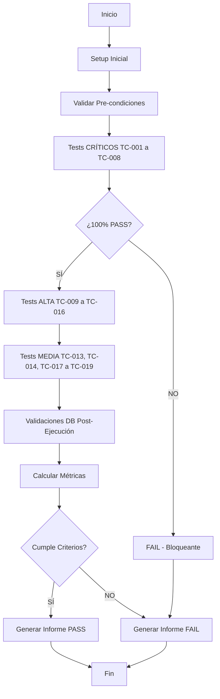

# Diseño Completo de Smoke Test - Sistema Torneo Pádel

## 📋 Índice

1. [Resumen Ejecutivo](#resumen-ejecutivo)
2. [Documentos Generados](#documentos-generados)
3. [Cómo Usar Este Sistema](#cómo-usar-este-sistema)
4. [Arquitectura del Smoke Test](#arquitectura-del-smoke-test)
5. [Quick Start](#quick-start)
6. [FAQ](#faq)

---

## Resumen Ejecutivo

Este documento describe el diseño completo de un **smoke test** para el sistema de torneo de pádel, diseñado para ser ejecutado por un **agente de IA** que evalúe las funcionalidades críticas del sistema.

### Objetivo

Validar las funcionalidades principales del sistema en los 5 roles de usuario, generando un informe detallado con resultados PASS/FAIL y análisis de desvíos.

### Alcance

- **19 Test Cases** organizados por prioridad (Crítica, Alta, Media)
- **5 Roles de Usuario**: Jugador/Viewer, Cargador, Admin, Vista General, Analytics
- **Validaciones End-to-End**: Interfaz de usuario + Base de datos
- **Informe Estructurado**: Con métricas, evidencias y recomendaciones

### Criterios de Éxito

✅ El smoke test **PASA** si:
- 100% de tests CRÍTICOS pasan
- ≥90% de tests ALTA prioridad pasan
- ≥80% de tests MEDIA prioridad pasan
- 0 defectos bloqueantes

---

## Documentos Generados

Este diseño completo incluye 4 documentos principales:

### 1. [SMOKE-TEST-CASES.md](./SMOKE-TEST-CASES.md) 📝
**Casos de Prueba Detallados**

Contiene los 19 test cases completos con:
- Pasos específicos a seguir
- Resultados esperados
- Validaciones de base de datos (SQL queries)
- Validaciones de localStorage y tracking
- Pre-condiciones y post-condiciones

**Estructura**:
- TC-001 a TC-005: Jugador/Viewer (CRÍTICO)
- TC-006 a TC-008: Cargador de Resultados (CRÍTICO)
- TC-009 a TC-012: Administrador (ALTA)
- TC-013: Vista General (MEDIA)
- TC-014: Analytics (MEDIA)
- TC-015 a TC-016: Integridad de Datos (ALTA)
- TC-017 a TC-018: UX/UI (MEDIA)
- TC-019: Performance (MEDIA)

### 2. [AI-AGENT-PROMPT.md](./AI-AGENT-PROMPT.md) 🤖
**Prompt Completo para el Agente de IA**

Instrucciones detalladas para el agente de IA que ejecutará el smoke test:
- Rol y responsabilidades del agente
- Información del sistema (URLs, tecnologías, base de datos)
- Metodología de ejecución paso a paso
- Acceso a la base de datos (queries útiles)
- Formato de documentación de resultados (PASS/FAIL)
- Consideraciones especiales (tests destructivos, dependencias, etc.)
- Criterios de éxito y checklist de ejecución

### 3. [SMOKE-TEST-REPORT-TEMPLATE.md](./SMOKE-TEST-REPORT-TEMPLATE.md) 📊
**Template del Informe de Resultados**

Plantilla completa del informe que debe generar el agente:
- Resumen ejecutivo con métricas
- Resultados por rol y por prioridad
- Bloqueantes identificados
- Recomendaciones priorizadas
- Detalle de cada test case (PASS/FAIL)
- Métricas de calidad
- Contexto del ambiente
- Anexos (screenshots, logs, queries SQL)

### 4. [SMOKE-TEST-COMPLETO.md](./SMOKE-TEST-COMPLETO.md) 📚
**Este Documento - Guía General**

Documento maestro que explica el sistema completo y cómo usarlo.

---

## Cómo Usar Este Sistema

### Para Ejecutores Humanos (QA Manual)

1. **Preparación**
   - Leer [AI-AGENT-PROMPT.md](./AI-AGENT-PROMPT.md) para entender contexto y metodología
   - Tener acceso al sistema (producción o desarrollo)
   - Preparar herramientas: Browser DevTools, acceso a Supabase

2. **Ejecución**
   - Abrir [SMOKE-TEST-CASES.md](./SMOKE-TEST-CASES.md)
   - Ejecutar test cases en orden de prioridad (CRÍTICOS primero)
   - Seguir pasos exactamente como están descritos
   - Ejecutar TODAS las validaciones de DB especificadas

3. **Documentación**
   - Copiar [SMOKE-TEST-REPORT-TEMPLATE.md](./SMOKE-TEST-REPORT-TEMPLATE.md)
   - Completar con resultados de cada test
   - Documentar PASS con notas breves
   - Documentar FAIL con desvíos detallados (formato especificado)

4. **Entrega**
   - Generar informe final completo
   - Incluir screenshots de errores
   - Incluir logs relevantes
   - Enviar con recomendaciones priorizadas

### Para Agentes de IA (Automatizado)

1. **Prompt Inicial**
   - Proporcionar el contenido completo de [AI-AGENT-PROMPT.md](./AI-AGENT-PROMPT.md) como prompt inicial
   - Incluir acceso a [SMOKE-TEST-CASES.md](./SMOKE-TEST-CASES.md) como contexto

2. **Ejecución Automatizada**
   - El agente ejecutará cada test case secuencialmente
   - Validará UI usando herramientas de browser automation (Playwright/Puppeteer)
   - Validará DB ejecutando queries SQL especificadas
   - Capturará screenshots y logs automáticamente

3. **Generación de Informe**
   - El agente usará [SMOKE-TEST-REPORT-TEMPLATE.md](./SMOKE-TEST-REPORT-TEMPLATE.md) como base
   - Completará automáticamente todas las secciones
   - Calculará métricas y porcentajes
   - Generará recomendaciones basadas en resultados

4. **Output**
   - Informe en formato Markdown
   - Screenshots de errores (si aplica)
   - Logs consolidados
   - Decisión final: PASS/FAIL del smoke test

---

## Arquitectura del Smoke Test

### Flujo de Ejecución



### Distribución de Test Cases

| Prioridad | Cantidad | % del Total | Criterio de Éxito |
|-----------|----------|-------------|-------------------|
| CRÍTICA | 8 | 42% | 100% PASS requerido |
| ALTA | 6 | 32% | ≥90% PASS requerido |
| MEDIA | 5 | 26% | ≥80% PASS requerido |
| **TOTAL** | **19** | **100%** | - |

### Cobertura Funcional

| Módulo | Test Cases | Validaciones UI | Validaciones DB |
|--------|------------|-----------------|-----------------|
| Identificación | TC-001 | ✅ | ✅ |
| Vista Personalizada | TC-002 | ✅ | ✅ |
| Carga de Resultados | TC-003, TC-007 | ✅ | ✅ |
| Confirmación | TC-004 | ✅ | ✅ |
| Gestión de Conflictos | TC-005, TC-008 | ✅ | ✅ |
| Vista Carga General | TC-006 | ✅ | ❌ |
| Admin - Parejas | TC-009 | ✅ | ✅ |
| Admin - Grupos | TC-010 | ✅ | ✅ |
| Admin - Copas | TC-011 | ✅ | ✅ |
| Admin - Modo Seguro | TC-012 | ✅ | ❌ |
| Vista General | TC-013 | ✅ | ❌ |
| Analytics | TC-014 | ✅ | ✅ |
| Integridad de Datos | TC-015, TC-016 | ❌ | ✅ |
| UX/UI | TC-017, TC-018 | ✅ | ❌ |
| Performance | TC-019 | ✅ | ✅ |

---

## Quick Start

### Ejecución Manual en 5 Pasos

```bash
# 1. Clonar repositorio y preparar ambiente
git clone [repo-url]
cd torneo-padel

# 2. Iniciar servidor (si es desarrollo local)
npm run dev

# 3. Abrir navegador en la URL del sistema
# Producción: https://torneo-padel-teal.vercel.app/
# Local: http://localhost:5173/

# 4. Abrir DevTools y ejecutar test cases siguiendo SMOKE-TEST-CASES.md
# Tip: Mantener abierto el documento en una ventana al lado

# 5. Documentar resultados en una copia de SMOKE-TEST-REPORT-TEMPLATE.md
```

### Ejecución con Agente de IA

**Opción 1: Prompt Directo**
```
Copiar el contenido completo de AI-AGENT-PROMPT.md y pegarlo como prompt inicial al agente.
Adjuntar SMOKE-TEST-CASES.md como documento de referencia.
```

**Opción 2: Automatización con Playwright (Futuro)**
```javascript
// tests/smoke-test.spec.js
const { test, expect } = require('@playwright/test');
const { supabase } = require('./helpers/db-client');

test.describe('Smoke Test - Torneo Pádel', () => {
  
  test('TC-001: Identificación de Jugador', async ({ page }) => {
    // Implementación automatizada del test case
    await page.goto('/');
    // ... seguir pasos de TC-001
  });

  // ... más tests
});
```

---

## FAQ

### ¿Por qué un smoke test y no un test completo?

El smoke test cubre las **funcionalidades críticas** que deben funcionar para que el sistema sea usable. No es exhaustivo, pero detecta problemas bloqueantes rápidamente.

### ¿Cuánto tiempo toma ejecutar el smoke test completo?

- **Manual**: 2-3 horas (aproximado)
- **Automatizado**: 15-30 minutos (con scripts)

### ¿Puedo ejecutar solo algunos test cases?

Sí, pero como mínimo debes ejecutar **TODOS los test cases CRÍTICOS** (TC-001 a TC-008) para considerar el smoke test válido.

### ¿Qué hago si el ambiente no tiene datos de prueba?

1. Si tienes acceso a `/admin`, usa TC-009 para importar parejas de prueba
2. Si no, documenta en el informe como "BLOCKED - Falta de datos de prueba"
3. Sugiere preparar un script de seed data para futuros tests

### ¿Los test cases son destructivos?

- **TC-009** (Import de Parejas): **SÍ, ES DESTRUCTIVO** - Borra y recrea datos
- Todos los demás: **NO** - Solo leen o crean datos sin destruir existentes

**Recomendación**: Ejecutar TC-009 SOLO en ambiente de desarrollo/testing.

### ¿Qué pasa si un test CRÍTICO falla?

El smoke test **FALLA automáticamente**. Los tests críticos son bloqueantes - si fallan, el sistema no es usable para su propósito principal.

### ¿Puedo adaptar los test cases?

Sí, pero documenta claramente cualquier desviación del diseño original en el informe. Los test cases están diseñados para ser completos, así que modificarlos puede reducir la cobertura.

### ¿Cómo accedo a la base de datos para las validaciones?

Desde la consola del browser:
```javascript
// Importar cliente Supabase
const { supabase, TORNEO_ID } = await import('/src/carga/context.js');

// Ejecutar query
const { data } = await supabase.from('partidos').select('*');
console.table(data);
```

Ver [AI-AGENT-PROMPT.md](./AI-AGENT-PROMPT.md) sección "Acceso a la Base de Datos" para queries útiles.

### ¿Qué hago con el informe generado?

1. Enviar al equipo de desarrollo
2. Priorizar defectos bloqueantes para fix inmediato
3. Usar como baseline para tracking de calidad
4. Archivar para comparar con futuros smoke tests

### ¿Con qué frecuencia debo ejecutar el smoke test?

- **Después de cada deploy a producción** (altamente recomendado)
- **Antes de eventos importantes** (ej: antes de un torneo)
- **Después de cambios mayores** en el código
- **Semanalmente** en ambiente de desarrollo (opcional)

---

## Próximos Pasos

### Implementación Recomendada

1. ✅ **Fase 1: Manual** (Actual)
   - Ejecutar manualmente siguiendo documentos
   - Validar que los test cases son correctos y completos
   - Generar primer informe baseline

2. 🔄 **Fase 2: Semi-Automatizado** (Próximo)
   - Crear scripts helper para validaciones de DB
   - Automatizar generación de métricas del informe
   - Crear script de seed data para tests

3. 🚀 **Fase 3: Completamente Automatizado** (Futuro)
   - Implementar con Playwright/Puppeteer
   - Integrar en CI/CD pipeline
   - Auto-ejecutar en cada deploy
   - Dashboard de resultados históricos

### Mejoras Sugeridas

- **Test de Seguridad**: Verificar RLS policies funcionan correctamente
- **Test de Accesibilidad**: WCAG compliance básico
- **Test de Mobile**: Responsive en dispositivos reales
- **Test de Carga**: Con 50+ parejas simultáneas
- **Test de Browser Compatibility**: Chrome, Firefox, Safari

---

## Recursos

### Documentos de Este Sistema
- [SMOKE-TEST-CASES.md](./SMOKE-TEST-CASES.md) - Test cases detallados
- [AI-AGENT-PROMPT.md](./AI-AGENT-PROMPT.md) - Prompt para agente IA
- [SMOKE-TEST-REPORT-TEMPLATE.md](./SMOKE-TEST-REPORT-TEMPLATE.md) - Template de informe

### Documentos del Proyecto
- [README.md](./README.md) - Documentación general
- [GUIA-TESTING-SISTEMA-CARGA.md](./guias/GUIA-TESTING-SISTEMA-CARGA.md) - Guía específica de testing
- [TRACKING-SISTEMA-README.md](./implementaciones/TRACKING-SISTEMA-README.md) - Sistema de tracking

### Links Externos
- Sistema en Producción: https://torneo-padel-teal.vercel.app/
- Repositorio: [URL del repo]
- Supabase Dashboard: [URL del proyecto]

---

## Contacto y Soporte

Para consultas sobre este diseño de smoke test:
- Crear issue en el repositorio
- Documentar en el canal de QA
- Contactar al equipo de desarrollo

---

**Versión del Documento**: 1.0  
**Última Actualización**: Enero 2026  
**Autor**: Sistema de Diseño de Smoke Test  
**Estado**: ✅ Completo y Listo para Usar
